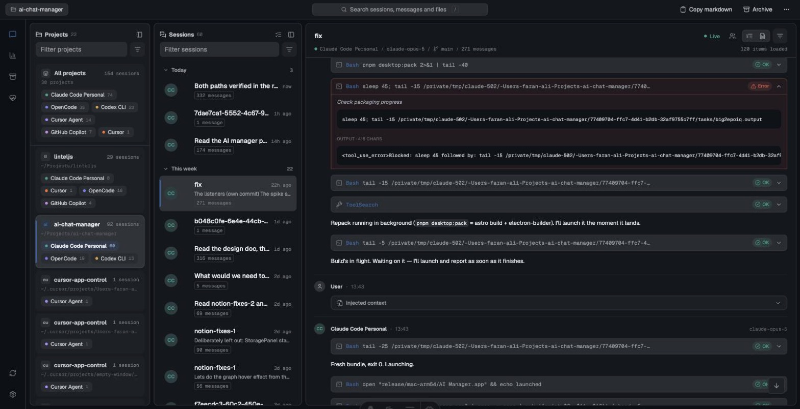
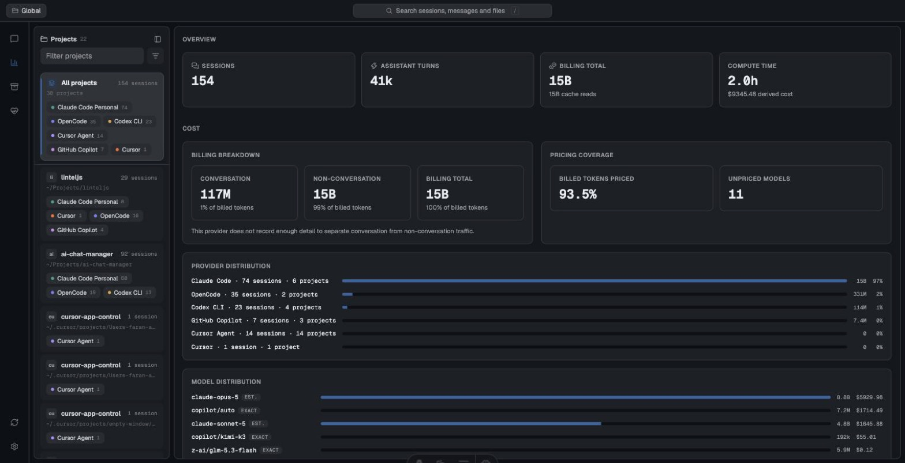
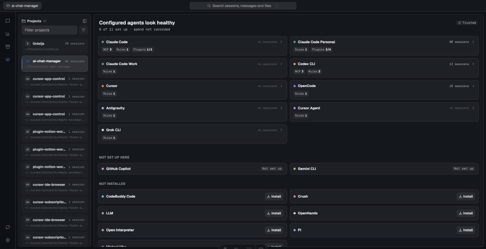
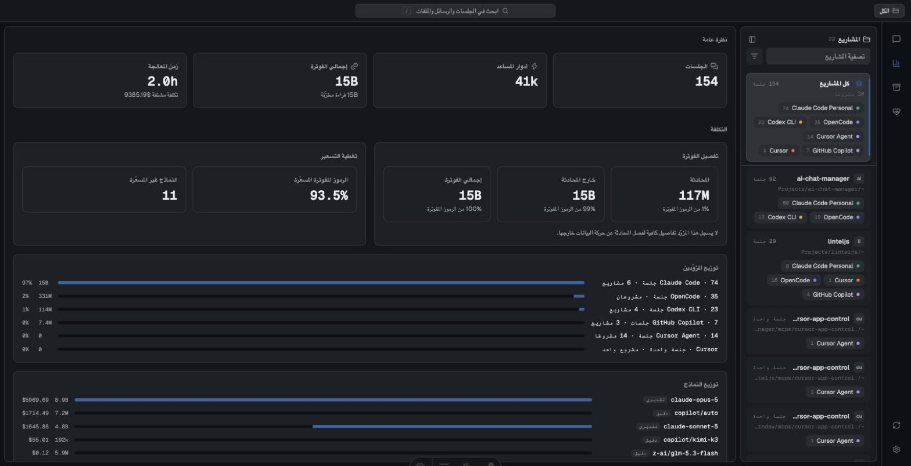

# AI Chat Manager

**English** ·
[العربية](docs/readme/README.ar.md) ·
[日本語](docs/readme/README.ja.md) ·
[한국어](docs/readme/README.ko.md) ·
[简体中文](docs/readme/README.zh-CN.md) ·
[繁體中文](docs/readme/README.zh-TW.md)

A fast, local-first viewer for AI coding-session history, built as an
[Astro](https://astro.build) island app and shipped to the desktop with
[Deno Desktop](https://docs.deno.com/runtime/desktop/) (Deno ≥ 2.9).

Reads transcripts straight off disk. No daemon, no account, no telemetry.



## Supported agents

| Agent | Reads | Tool calls |
|---|---|---|
| Claude Code | `~/.claude/projects` JSONL | yes |
| Codex CLI | `~/.codex` JSONL | yes |
| GitHub Copilot | VS Code `chatSessions` journals | yes |
| OpenCode | SQLite store | yes |
| Cursor | `state.vscdb` (`cursorDiskKV`) | yes |
| Goose, Zed, Amazon Q, Kiro, ForgeCode | SQLite | varies |
| Gemini CLI, Cline, Aider, Continue, Qwen and ~15 more | files | text only |

Every agent normalises into one timeline model, so the viewer looks the same
whichever tool produced the session.

## Screenshots

| Analytics | Agent health |
|---|---|
|  |  |

Six locales, including right-to-left Arabic with a fully mirrored layout:



## Quick start

```bash
pnpm install

pnpm dev            # web dev server
pnpm check          # lint + stylelint + typecheck + tests(100%) + build
```

### Desktop (Deno)

```bash
pnpm desktop        # build once, then compile & launch the desktop app
pnpm desktop:dev    # desktop shell around the dev server (hot reload)
pnpm desktop:build  # produce dist/AIChatManager.app
```

Deno auto-detects Astro, embeds `dist/`, and runs the Node-adapter server
inside the Deno runtime; the UI renders in the OS webview. The same server
also runs standalone: `node dist/server/entry.mjs`.

## Features

- Projects & sessions browsing with filters, previews, custom titles
- Rich transcript rendering: markdown, syntax-highlighted code, collapsible
  thinking, per-tool cards with unified diffs, todo lists, images, stdout/stderr
- Agent-sidechain toggle, incremental "load more" paging
- Cross-project full-text search with jump-to-message
- Token/cost analytics: models, tools, activity heatmap, top sessions
- Export sessions as Markdown or JSON
- Six UI languages (English, العربية, 日本語, 한국어, 简体中文, 繁體中文) with
  RTL support and correct plural rules per locale
- Update checks against a signed release feed
- Dark / light / system theme, keyboard search (`/`, ⌘K)

## Internationalisation

Locale files live in `src/i18n/locales/<lang>/<namespace>.json`. Adding a
language is a new folder plus one entry in `src/i18n/config.ts`; set `dir: 'rtl'`
and the layout mirrors itself, because the styles use logical properties
(`ms`/`me`, `ps`/`pe`, `text-start`) rather than physical ones.

A test asserts every language ships the same keys, that none are blank, and that
no translation introduces a placeholder English never defined. Relative
timestamps come from `Intl.RelativeTimeFormat`, so they need no keys at all.

## Updates

`Deno.autoUpdate()` patches binaries in place, which breaks a signed macOS
bundle ([denoland/deno#36574](https://github.com/denoland/deno/pull/36574)), and
Windows cannot apply patches at all. So updates ship as **full artifacts**: the
app reads one `latest.json`, verifies the Ed25519 envelope and SHA-256, then
hands off to an installer and exits.

| Platform | Install path |
|---|---|
| macOS | helper waits for exit, `ditto` unpacks, relaunches |
| Linux | helper swaps the AppImage, relaunches |
| Windows | `msiexec` takes the `.msi` |

Set `UPDATE_FEED_URL` (and `UPDATE_PUBLIC_KEY` to require signed manifests).
Without a feed the app simply never offers updates.

Cutting a release is one tag push; see [RELEASE.md](RELEASE.md).

## Architecture

LintelJS layout (`plugins/linteljs/skills/linteljs/SKILL.md` is the contract):

```
src/
  pages/
    index.astro        mounts the single client island
    api/*.ts           POST endpoints (kebab-case file = URL segment)
  components/
    ui/                primitives, motion tokens, ConfirmDialog, MarkdownText
    features/          app-shell, sidebar, session-viewer, search, analytics,
                       theme, language, updates, history-data hooks
  i18n/                runtime, language config, locale namespaces
  lib/
    services/          one <domain>Service.ts entry per folder, plus
                       constants.ts and utils/*Utils.ts supporting modules:
                       agents, export, history, search, session, stats, updates
    apis/              wire contracts, endpoint handlers, typed fetch client
    utils/             formatting, diff pairing, clipboard/download helpers
  config/              constants and CLAUDE_CONFIG_DIR resolution
```

Data flow: `island → apiClient (validated fetch) → /api route → endpoints →
services → on-disk agent histories`. Services never touch HTTP; routes are thin;
the client validates every response shape before use. Outside a service domain,
imports go through its facade (`@services/<domain>`); lint enforces this.

## Roadmap

- Archive manager, MCP server/preset managers
- Subagent (sidechain) transcript drill-down, board/kanban view,
  screenshot capture, WebUI remote-login mode

## License

[MIT](LICENSE)
